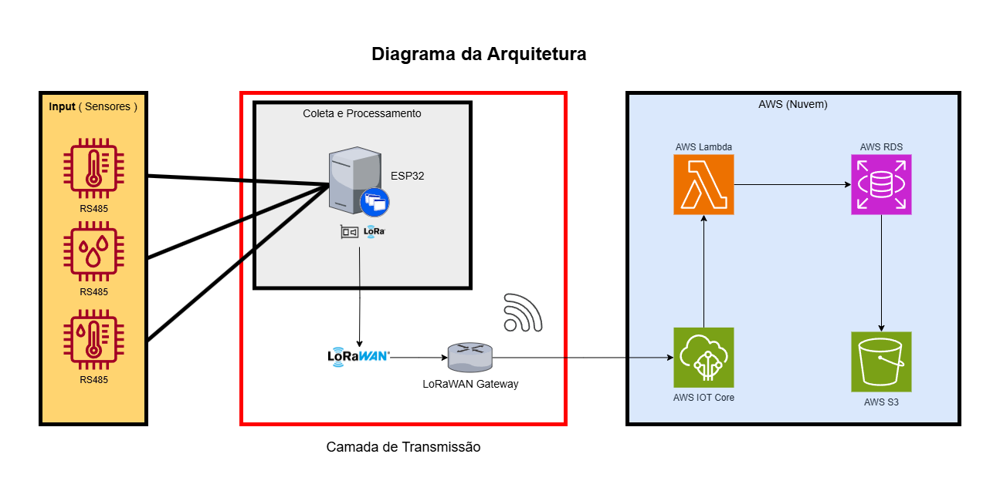

The solution architecture was designed considering the **MVP** without **5G** or **LoRaWAN** coverage. In this scenario, a **LoRaWAN gateway** would be configured to receive data from the **ESP32 collector**.

### **Scenario: No LoRaWAN and No 5G Coverage (With Alternative Gateway)**  

📌 **Transmission Flow:**  
1. **Sensors capture environmental data** (ESP32 + RS485 sensors).  
2. **ESP32 transmits via LoRa to a LoRa Gateway** (local coverage of 1-3 km).  
3. **The Gateway transmits data to AWS via Wi-Fi, Ethernet, or satellite.**  
4. **AWS IoT Core processes and stores the data:**  
   - **AWS Lambda:** Initial data processing.  
   - **AWS RDS (PostgreSQL):** Stores historical records.  
   - **AWS S3:** Stores logs and backups.  