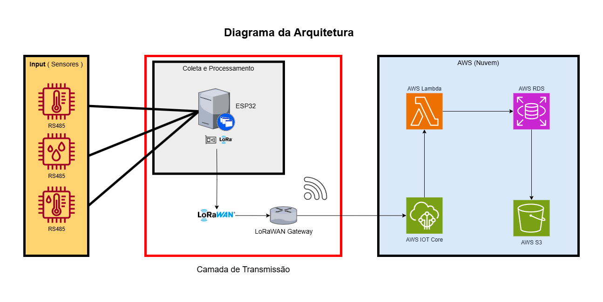

The architecture developed for the agricultural monitoring system was initially planned for a Minimum Viable Product (MVP) scenario, where no public 5G or LoRaWAN network coverage is assumed. Given this, the adopted model considers the installation of a dedicated gateway with LoRaWAN technology to act as an intermediary between the field collection devices and the cloud infrastructure, ensuring data transmission even in remote rural areas.

Environmental sensors connected to ESP32 modules are responsible for collecting variables such as humidity, temperature, pH, and soil electrical conductivity. These sensors use the RS485 (Modbus RTU) protocol for communication and are read by the microcontroller, which performs data preprocessing and sends it via LoRa radio to a gateway located up to 3 km away. The use of LoRa technology ensures low energy consumption and stable communication even in areas with limited network infrastructure.

On the gateway side, the device acts as a bridge between the local sensor network and the internet, using alternative connections such as Wi-Fi, Ethernet, or, if necessary, satellite connection. Data transmission is carried out using the MQTT protocol, directly to the AWS IoT Core service, where the processing chain begins.

Once in the cloud, data is received by AWS IoT Core, which acts as a manager for connected devices and received messages. From this point, an AWS Lambda function is triggered to perform the initial data processing. This function may include tasks such as integrity validation, data enrichment with external information (such as NDVI), and formatting for subsequent storage. The processed data is then forwarded to two main destinations: a relational database (AWS RDS, based on PostgreSQL), which serves as a structured historical repository; and the AWS S3 service, used to store logs, backups, and auxiliary files.

This modular architecture was designed to be scalable, cost-effective, and adaptable to different geographical contexts. By opting for a model that does not rely solely on public network coverage, operability is ensured even in rural areas with limited connectivity, offering a resilient solution tailored to the realities of the field.

---

---

## Data Transmission and Processing Flow

| Step                          | Component                      | Main Function                                                               |
|-------------------------------|---------------------------------|------------------------------------------------------------------------------|
| **Data Collection**           | ESP32 + RS485 Sensors           | Captures local environmental variables (soil/air)                           |
| **Local Transmission (LoRa)** | LoRa radio embedded in ESP32    | Sends data up to 3 km to the local gateway                                 |
| **Dedicated Gateway**         | LoRaWAN Gateway (Wi-Fi/Eth/Sat) | Routes data to the internet, acts as local network intermediary            |
| **Cloud (Reception)**         | AWS IoT Core                    | Manages devices and receives data via MQTT                                 |
| **Cloud (Processing)**        | AWS Lambda                      | Processes received data, applies validations and formatting                 |
| **Cloud (Storage)**           | AWS RDS (PostgreSQL)            | Stores structured historical records                                       |
| **Cloud (Storage)**           | AWS S3                          | Stores files, logs, and backups                                             |

---
